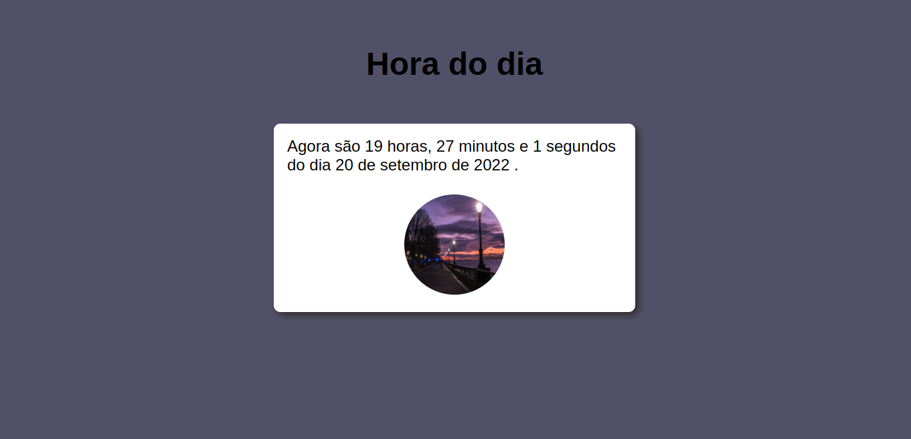

<h1 align="center"><a href="#" alt="Digital clock"> DIGITAL CLOCK ⏲️  </a></h1>

 <h4 align="center"> 🟢 Status do projeto:  Concluído ✔️   </h4>  

## 💻 Descrição do projeto 

 É um projeto desenvolvido durante o curso de JavaScrpit da plataforma curso em vídeo
 
  

## 🚀 Como Acessar o projeto
[Clique aqui para acessar](https://anafts.github.io/Digital-Clock/)

 

## 🛠️ Linguagens: 

